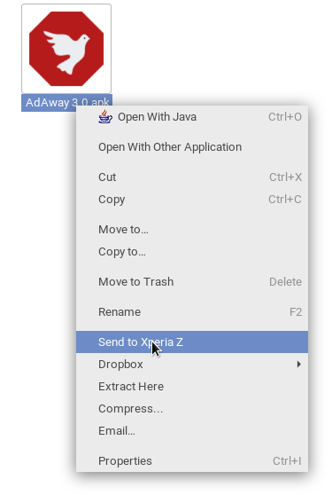

nautilus-kdeconnect
====================
Nautilus extension for sending files to devices connected via KDE Connect.

KDE Connect is a service that connects your Android device with your Linux PC via Wi-Fi, enabling many features like shared clipboard, notification syncing, file sharing and media playback control. This extension provides file sharing support in Nautilus via context menu (right-click menu).

Features
---------
* Send any number of files at once. _(Directories are also supported and sent as ZIPs)_.
* Send files to any connected device.

Installation
-------------
In addition to [KDE Connect](https://community.kde.org/KDEConnect), this extension requires [nautilus-python](https://wiki.gnome.org/Projects/NautilusPython) and libnotify. 

## Instructions for Arch Linux

1. On your PC, install `kdeconnect-git`, `kde-cli-tools`, `python2-nautilus` and `libnotify`.
2. Install the KDE Connect companion app for Android, available on [Google Play](https://play.google.com/store/apps/details?id=org.kde.kdeconnect_tp) and [F-Droid](https://f-droid.org/repository/browse/?fdid=org.kde.kdeconnect_tp).
3. Launch KDE Connect on your PC and on your Android device. Pair the two devices and enable the sharing plugin.
4. Clone this repository and install the extension: `git clone https://github.com/forabi/nautilus-kdeconnect && make -C nautilus-kdeconnect install`.

## Instructions for Fedora

1. On your PC, install `kdeconnectd`, `kde-cli-tools`, `nautilus-python-devel`, `libnotify`
 and `libnotify-devel`.
2. Install the KDE Connect companion app for Android, available on [Google Play](https://play.google.com/store/apps/details?id=org.kde.kdeconnect_tp) and [F-Droid](https://f-droid.org/repository/browse/?fdid=org.kde.kdeconnect_tp).
3. Launch KDE Connect on your PC and on your Android device. Pair the two devices and enable the sharing plugin.
4. Clone this repository and install the extension: `git clone https://github.com/forabi/nautilus-kdeconnect && make -C nautilus-kdeconnect install`.

### Nemo file manager

*nautilus-kdeconnect* can also be used with the Nemo file manager:

1. On your PC, install the `kdeconnect`, `python-nemo`, `libnotify-bin` and `git` packages.
     * If you are using some Debian-based distribution that is not *Linux Mint*, you won't find the `python-nemo` package in the software repositories:
        1. Download and install the [`python-nemo` package](http://packages.linuxmint.com/pool/backport/n/nemo-python/) from the *Linux Mint* package archive site.
        2. Run `sudo ln -s /usr/lib/nemo/extensions-3.0/libnemo-python.so /usr/lib/x86_64-linux-gnu/nemo/extensions-3.0/` to create a compatibility symlink to newly installed the extension file.
2. Install the KDE Connect app for Android as mentioned above ([Google Play](https://play.google.com/store/apps/details?id=org.kde.kdeconnect_tp) / [F-Droid](https://f-droid.org/repository/browse/?fdid=org.kde.kdeconnect_tp)).
3. Launch KDE Connect on your PC and on your Android device. Pair the two devices and enable the sharing plugin.
4. Clone this repository and install the extension with the `Nemo` target: `git clone https://github.com/Dragoncraft89/nautilus-kdeconnect nemo-kdeconnect && make -C nemo-kdeconnect install TARGET=Nemo`.

### Caja file manager

*nautilus-kdeconnect* can also be used with the Caja file manager:

1. On your PC, install the `kdeconnect`, `python-caja`, `libnotify-bin` and `git` packages.
2. Install the KDE Connect app for Android as mentioned above ([Google Play](https://play.google.com/store/apps/details?id=org.kde.kdeconnect_tp) / [F-Droid](https://f-droid.org/repository/browse/?fdid=org.kde.kdeconnect_tp)).
3. Launch KDE Connect on your PC and on your Android device. Pair the two devices and enable the sharing plugin.
4. Clone this repository and install the extension with the `Caja` target: `git clone https://github.com/Dragoncraft89/nautilus-kdeconnect caja-kdeconnect && make -C caja-kdeconnect install TARGET=Caja`
